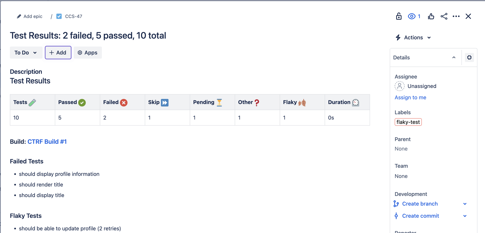

# Jira Test Results Notification

> Create a Jira issue with test results from popular testing frameworks

A Jira test reporting tool that supports all major testing frameworks.
Generate, publish and alert your team with detailed test results, including
summaries, in-depth reports, failed test analyses, flaky test detection directly to your chosen Jira project.

## CTRF Open Standard

CTRF is a community-driven open standard for test reporting.

By standardizing test results, reports can be validated, merged, compared, and analyzed consistently across languages and frameworks.

- **CTRF Specification**: https://github.com/ctrf-io/ctrf  
  The official specification defining the format and semantics
- **Discussions**: https://github.com/orgs/ctrf-io/discussions  
  Community forum for questions, ideas, and support

> [!NOTE]  
> ⭐ Starring the **CTRF specification repository** (https://github.com/ctrf-io/ctrf)
> helps support the standard.

## Features

- **Create Issue in Jira**: Automatically create an issue in Jira.
- **Send Flaky Test Details to Jira**: Automatically send flaky test details to a Jira issue.
- **Conditional Notifications**: Use the `--onFailOnly` option to send notifications only if tests fail.



## Setup

You'll need a CTRF report generated by your testing framework. [CTRF reporters](https://github.com/orgs/ctrf-io/repositories) are available for most testing frameworks and easy to install.

**No CTRF reporter? No problem!**

Use [junit-to-ctrf](https://github.com/ctrf-io/junit-to-ctrf) to convert a JUnit report to CTRF.

### Set the Environment Variable

Set the webhook URL as an environment variable in your shell or CI environment:

```sh
export JIRA_URL='https://your-domain.atlassian.net'
export JIRA_EMAIL='your-email@example.com'
export JIRA_API_TOKEN='your-jira-api-token'
```

Make sure to replace `'https://your-domain.atlassian.net'` with your actual Jira URL.

You might want to store these as secrets in your CI environment.

## Required Arguments

- `project`: The Jira project key.
- `issueTypeId`: The Jira issue type. [More info](https://confluence.atlassian.com/jirasoftwarecloud/finding-the-issue-type-id-in-jira-cloud-1333825937.html)

## Installation

### Global installation

Install `jira-ctrf` globally:

```sh
pnpm add -g jira-ctrf
```

Or with npm:

```sh
npm install -g jira-ctrf
```

Then run:

```sh
jira-ctrf results ./ctrf-report.json --project CCS --issueTypeId 10000
```

### Ephemeral execution

Use your package manager's executable runner:

```sh
pnpm dlx jira-ctrf@0.0.8 results ./ctrf-report.json --project CCS --issueTypeId 10000
```

Or with npm:

```sh
npx jira-ctrf@0.0.8 results ./ctrf-report.json --project CCS --issueTypeId 10000
```

> [!NOTE]
> For ephemeral execution, it is recommended to pin the package version (for example, `jira-ctrf@0.0.8`).

> [!TIP]
> Ephemeral execution works well with other non-Node.js projects. No local installation is required—only Node.js and a supported package manager.

> [!TIP]
> If you're using a Node.js project, consider installing `jira-ctrf` as a development dependency instead. This can be executed with `pnpm exec` or `npm exec`.

## Usage

You can use a glob pattern or a single file path to send the test results summary to Jira.

### Results

To send the test results summary to Jira:

```sh
jira-ctrf results /path/to/ctrf-report.json --project CCS --issueTypeId 10000
```

You can use a glob pattern with multiple files which will be merged together:

```sh
jira-ctrf results "ctrf/*.json" --project CCS --issueTypeId 10000
```

### Flaky

To send flaky test report to Jira:

```sh
jira-ctrf flaky /path/to/ctrf-report.json --project CCS --issueTypeId 10000
```

### Send Only on Failures

To send the test results summary to Jira only if there are failed tests, use the `--onFailOnly` option:

```sh
jira-ctrf results /path/to/ctrf-file.json --onFailOnly --project CCS --issueTypeId 10000
```

### Custom Notification Title

You can choose a custom title for your notification, use the `--title` option:

```sh
jira-ctrf results /path/to/ctrf-file.json --title "Custom Title" --project CCS --issueTypeId 10000
```

## Options

| Option         | Description                                                                                                 | Default                |
| -------------- | ----------------------------------------------------------------------------------------------------------- | ---------------------- |
| `title`        | Custom title for the Jira issue                                                                             | "Test Results Summary" |
| `prefix`       | Text to add before the test results                                                                         | ""                     |
| `suffix`       | Text to add after the test results                                                                          | ""                     |
| `onFailOnly`   | Only create Jira issues when tests fail                                                                     | false                  |
| `project`      | Jira project key                                                                                            | ""                     |
| `issueTypeId`  | Jira issue type ID                                                                                          | undefined              |
| `labels`       | Labels to add to the Jira issue                                                                             | []                     |
| `components`   | Components to add to the Jira issue                                                                         | []                     |
| `assignee`     | Username of the person to assign the Jira issue to                                                          | undefined              |
| `priority`     | Priority of the Jira issue                                                                                  | undefined              |
| `fixVersions`  | Comma-separated list of fix versions to add to the Jira issue                                               | []                     |
| `tableHeaders` | Comma-separated list of table headers to include (tests,passed,failed,skipped,pending,other,flaky,duration) | All headers            |
| `debug`        | Enable debug mode to see the payload being sent to Jira                                                     | false                  |

## Merge reports

If you use a glob pattern, the reports will be merged automatically.

Otherwise, the [ctrf-cli](https://github.com/ctrf-io/ctrf-cli) package provides a method to merge multiple ctrf json files into a single file.

After executing your tests, use the following command:

```sh
ctrf-cli merge <directory>
```

Replace directory with the path to the directory containing the CTRF reports you want to merge.

## Programmatic Usage

You can use the package programmatically to send notifications to Jira. To install the package, run:

```sh
pnpm add jira-ctrf
```

Or with npm:

```sh
npm install jira-ctrf
```

The package exports the following functions:

- `sendTestResultsToJira`
- `sendFlakyResultsToJira`

```ts
import { sendTestResultsToJira } from 'jira-ctrf'

sendTestResultsToJira(report)
```

## What is CTRF?

CTRF is a universal JSON test report schema that addresses the lack of a standardized format for JSON test reports.

**Consistency Across Tools:** Different testing tools and frameworks often produce reports in varied formats. CTRF ensures a uniform structure, making it easier to understand and compare reports, regardless of the testing tool used.

**Language and Framework Agnostic:** It provides a universal reporting schema that works seamlessly with any programming language and testing framework.

**Facilitates Better Analysis:** With a standardized format, programatically analyzing test outcomes across multiple platforms becomes more straightforward.

## Support Us

If you find this project useful, consider giving it a GitHub star ⭐ It means a lot to us.
